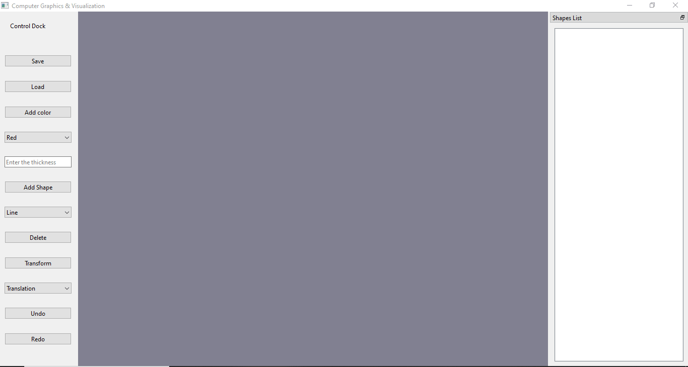

# Computer Graphics Visualization Project

This project is a combination of VTK, OpenGL, Qt, and CMake for creating 2D and 3D shapes and applying various transformations on them.

## Table of Contents

- [Features](#Features)
- [Preview](#Preview)
- [Installation](#Installation)
- [Usage](#Usage)
- [Acknowledgements](#Acknowledgements)

## Features

- Drawing various shapes in 2D and 3D
- Changing the thickness and color of the shapes
- Reading and writing shapes from an external txt file and csv file
- Applying transformations such as translation, rotation, and shearing
- Editing specific shapes, all shapes, or the last shape drawn
- Displaying all the shapes in the renderer window on the right sidebar
- Undo and redo options for the shapes
- Flexibility to draw shapes using either mouse click or by entering points as an input

## Preview

## Installation

1. Download and install Qt: https://www.qt.io/download
2. Download and install VTK: https://vtk.org/download/
3. Set your environmental variables for Qt and VTK
4. Create a build directory: `mkdir build`
5. Navigate to the build directory: `cd build`
6. Run CMake: `cmake ..`
7. Build the project: `make`

## Usage

1. Run the program
2. Draw shapes by selecting the shape type and clicking on the renderer window
3. Change the thickness and color of the shape by selecting the corresponding options in the sidebar
4. Apply transformations to the shape by selecting the transformation type and dragging the shape in the renderer window
5. Edit the shape by selecting the edit option in the sidebar and clicking on the shape in the renderer window
6. Save the shapes to a txt or csv file by selecting the save option in the sidebar
7. Load shapes from a txt or csv file by selecting the load option in the sidebar
8. Undo and redo the previous actions by selecting the corresponding options in the sidebar

## Acknowledgements

Submitted to: Dr. Ahmed Elbaily & Eng. Laila
All rights reserved © 2023 to Team 8 - HealthCare Engineering and Management, Cairo University (Class 2025)

